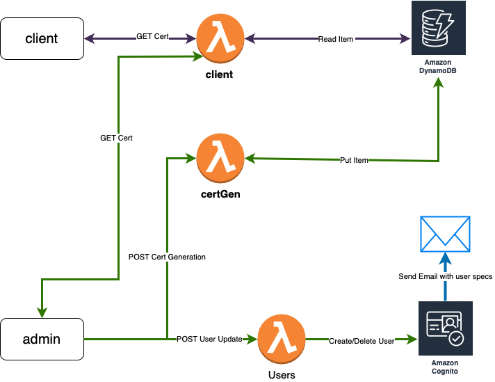

# AwsCertGenerator

Cert Generator is a hobby project that aim to automate TLS self signed certificates. Cert generator can be used locally as standalone binary, as well as aws deployment. 

# AWS infrasructure
aws infrastructure is handled by terrafrom:  

`client` and `admin` binaries are not a part of AWS cloud.

least privilege permission rule was applied
client and admin have very limited permissions: 
* `client` -> invoke client lambda
* `admin` -> invoke client, admin, users lambdas

admin and client, binaries do not have access to any other internal resources. Access to specific resource is defined in each lambda that `client` and `admin` can invoke.

## Prerequisities
In order to create AWS infrastructure, use following policy: [aws-permission.json](doc/aws-permissions.json)  
## steps
1. build go binary from `main.go` in  `/src/cert-generator/` dir:
   `$  GOOS=linux GOARCH=amd64 go build -tags lambda.norpc -o bootstrap main.go`
2. zip pacakge:  
   a. bootstrap.zip for certGenerator  
   b. client.zip for cognito-client  
   c. users.zip for cognito-users 
3. place .zip files in `/terraform` dir.  
4. customise terraform variables if needed.
5. run terraform apply command.
